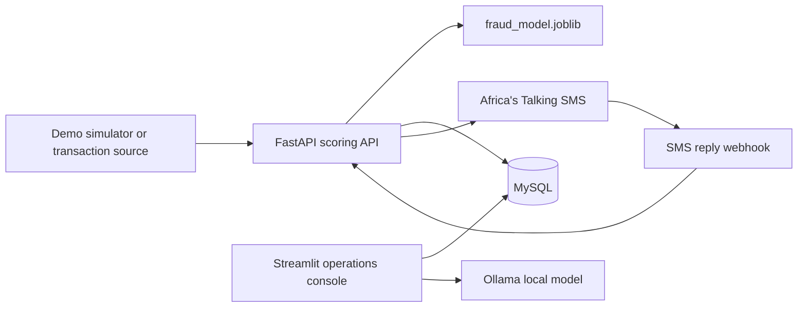

# FRDefense

FRDefense is a fraud detection and operations dashboard for mobile money and telecom payment workflows. It scores transactions with a bundled machine-learning model, records risk explanations for review, and helps operations staff follow up on suspicious activity.

> **Project status:** This repository is a demonstration and integration prototype. Connect it to approved test data and sandbox services before evaluating it in a real environment. It does not replace a production fraud-control or account-freezing system.

## What it does

- Scores transactions through a FastAPI service and classifies them as low, medium, or high risk.
- Stores transaction status, model score, feature snapshot, and the top SHAP explanation drivers in MySQL.
- Sends SMS verification requests for medium- and high-risk transactions when Africa's Talking is configured. Subscriber replies can confirm or deny a transaction.
- Escalates unanswered verification cases after their response deadline.
- Provides a Streamlit console with transaction overview, escalation review, fraud-ring visualization, a local AI assistant, and usage-based billing estimates.
- Includes a demo simulator with synthetic scenarios. The simulator disables SMS delivery by default.

## Architecture



The repository does not include a real telecom transaction-source integration. The simulator stands in for that upstream system during demonstrations.

## Requirements

- Docker Desktop with Docker Compose, or Python 3.11 for running services outside Docker.
- The included `fraud_model.joblib` model artifact.
- Africa's Talking sandbox or production credentials for live SMS delivery. These are not needed by the simulator, which runs with SMS disabled.
- Ollama with the `llama3.2:3b` model for the AI assistant. Ollama is an optional service and is not included in the Compose stack.

## Quick start with Docker Compose

From the repository root, enter the project directory:

```powershell
cd "Defense system"
```

Create a `.env` file in that directory. Keep real secrets out of source control:

```dotenv
MYSQL_PASSWORD=replace_with_a_local_database_password
MYSQL_DATABASE=fraud_db
DB_CONNECTION_STRING=mysql+pymysql://root:replace_with_a_local_database_password@db:3306/fraud_db

# Required by the API's SMS client initialization; use sandbox credentials for testing.
AT_USERNAME=sandbox
AT_API_KEY=replace_with_your_africas_talking_api_key
```

If the database password contains reserved URL characters, URL-encode it in `DB_CONNECTION_STRING`.

Build and start the database, API, and dashboard:

```powershell
docker compose up --build
```

Open the services:

- Dashboard: [http://localhost:8501](http://localhost:8501)
- Interactive API documentation: [http://localhost:8000/docs](http://localhost:8000/docs)
- MySQL is published on port `3307` on the host.

Stop the stack with `Ctrl+C`, or run `docker compose down`. The MySQL data volume is retained by default. To remove it as well, run `docker compose down -v` (this deletes the local demo database).

## Run a safe demo

With the Compose stack running, open a second terminal in `Defense system` and run:

```powershell
python -m pip install requests
python demo/stream_simulator.py
```

The simulator posts synthetic transaction scenarios to `http://localhost:8000/score` with `dry_run=true`. This prevents SMS delivery. One scenario deliberately creates an unanswered case for the escalation queue, and ring scenarios seed demo graph data. Re-running the simulator adds more records to the local database.

## Service behavior

### Scoring API

`POST /score` accepts a transaction feature vector and returns its fraud score, risk level, SHAP reasons, SMS delivery indicator, and current status. The `dry_run=true` query parameter stores a result without sending SMS. `escalate_demo=true` is only accepted with dry-run enabled and is provided for demonstrations.

`POST /sms/incoming` accepts Africa's Talking reply webhook fields. `YES` confirms a pending transaction; `NO` denies it and records a freeze request. The API also checks expired pending cases in the background and moves them to the escalation status.

### Operations dashboard

The Streamlit console reads from MySQL and presents recent transaction KPIs and records, escalated cases with verification and resolution actions, the latest fraud-ring graph, an assistant backed by local Ollama, and Starter/Growth billing estimates.

### External-system boundaries

The `freeze_account` function records a freeze request in the database; it does not call a bank or telecom account service. SMS webhook availability, credentials, and provider setup must be configured separately. The AI assistant requires a running Ollama service accessible to the dashboard and the `llama3.2:3b` model to be available there.

## Configuration reference

| Variable | Purpose |
| --- | --- |
| `MYSQL_PASSWORD` | MySQL root password used by the Compose database service. |
| `MYSQL_DATABASE` | Database initialized by MySQL; use `fraud_db` for the included schema. |
| `DB_CONNECTION_STRING` | SQLAlchemy connection URL used by the API and dashboard. In Compose, the database host is `db`. |
| `AT_USERNAME` | Africa's Talking application username, usually `sandbox` for testing. |
| `AT_API_KEY` | Africa's Talking API key. Keep it private and out of commits. |

The database schema is initialized from `src/db/schema.sql` when the MySQL data volume is first created. Changing the schema file later does not automatically migrate an existing volume.

## Project layout

```text
Defense system/
├── demo/stream_simulator.py    # Synthetic transaction scenarios
├── fraud_model.joblib          # Bundled fraud model and feature list
├── src/
│   ├── api/main.py             # FastAPI scoring, SMS replies, escalation
│   ├── app.py                  # Streamlit operations console
│   ├── db/                     # MySQL schema and data helpers
│   └── billing/                # Plan definitions and bill calculation
├── docker-compose.yml
├── Dockerfile
└── requirements.txt
```

## Security and production considerations

- Use synthetic or appropriately protected data in demos; the simulator uses synthetic phone numbers.
- Keep `.env` files and provider keys private. Rotate any credential that has been exposed.
- Use provider sandbox credentials while testing SMS flows.
- Configure TLS, authentication, authorization, secret management, database migrations, monitoring, and rate limits before exposing services beyond a trusted development environment.
- Connect escalation and account actions to the relevant partner systems only through their approved, audited interfaces.

## License

No license file is currently included. Contact the project maintainers for usage and redistribution terms.
